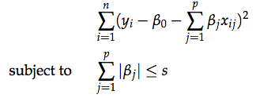

## Question 1  

**Suppose we estimate the regression coefficients in a linear regression model by minimizing**

 


**for a particular value of s. For parts (a) through (d), indicate which of i. through v. is correct.**

**i. Increase initially, and then eventually start decreasing in an inverted U shape.**  
**ii. Decrease initially, and then eventually start increasing in a U shape.**  
**iii. Steadily increase.**  
**iv. Steadily decrease.**  
**v. Remain constant.**  


**(a) As we increase s from 0, the training RSS will:**  
*iv. Steadily decreases.  As we increase s from 0, the model becomes more flexible and βj is constrained and will increase to the least squares estimate.*

**(b) Repeat (a) for test RSS.**  
*ii. Deacrease intially, and then eventually start increase in a U shape. As we increase s from 0, at first βj is constrained and forced close to 0 due to overfitting and then increases again as coefficients are removed from the model.*

**(c) Repeat (a) for variance.**  
*iii. Steadily increases.  When s = 0, the model has no variance.  However, as we increase s from 0, the model incorporates more βs, which increases the variance.* 
  
**(d) Repeat (a) for (squared) bias.**
*iv. Steadily decreases.  When s = 0, the model is highly biased.  However, as we increase s from 0, the βs in the model move away from 0 and decrease the bias.*


## Question 2

**In this exercise, we will predict the number of applications received using the other variables in the `College` data set.**

*Let's load the college dataset...*
```{r, include = FALSE}
# Load ISLR Library
library(ISLR)
library(glmnet)
library(pls)

# Set the Seed for reproducibility
set.seed(11)
```

```{r}
# Look at what the data structure looks like
# How many rows and columns?
dim(College) # Number of Rows, Columns

# What type of data do we have?
str(College)

#How many variables do we have in the data?
ncol(College)

# What variables do we have in the data?
colnames(College)
```

**(a) Split the data set into a training set and a test set.**
```{r}
## set the seed to make your partition reproductible
set.seed(123)
# Randomly pick observations from the data for the test data
train <-  sample(1:dim(College)[1], dim(College)[1] / 2)
test <- -train

# Create the training and testing data
train_college <- College[train, ]
test_college <- College[test, ] # Remove the training data est data

# How many observations in the training and testing data?
nrow(train_college)  
nrow(test_college)  
```


**(b) Fit a linear model using least squares on the training set, and report the test error obtained.**
```{r}
# Run the linear model 
linear_model <- lm(Apps ~ ., data = train_college)
summary(linear_model)
linear_prediction <- predict(linear_model, test_college)
linear_MSE <- mean((linear_prediction - test_college$Apps)^2); linear_MSE
```
*The mean squared error or MSE is $`r linear_MSE`$, which is extremely large.*  


**(c) Fit a ridge regression model on the training set, with λ chosen by cross-validation. Report the test error obtained.**
```{r}
# Create a model matrix from the train and test data
train_matrix <- model.matrix(Apps ~ ., data = train_college)
test_matrix <- model.matrix(Apps ~ ., data = test_college)
grid = 10^seq(10, -2, length=100)
# With lambda = grid we will implement a ridge regression over a a grid ov values ranging from 10^10 to 10^-2.  This way we cover the full range of scenarios from the null model containing only the intercept, to the least squares fit
# When alpha = 0 we fit a ridge regression
ridge <- glmnet(train_matrix, train_college$Apps, alpha = 0, lambda = grid, thresh = 1e-12)
plot(ridge)
# Run a k=fold cross validation for the ridge regression model 

cv_ridge  <- cv.glmnet(train_matrix, train_college[, "Apps"], alpha=0)
plot(cv_ridge)
best_lambda_ridge <- cv_ridge$lambda.min
best_lambda_ridge # The best lambda value!
```

*From above, we see that the value of λ that results in the smallest cross validation error for ridge regression is $`r best_lambda_ridge`$.* 

```{r}
# What is the test MSE associated with this best value of λ for ridge regression?
ridge_prediction <- predict(ridge, newx = test_matrix, s = best_lambda_ridge)
ridge_MSE <- mean((ridge_prediction - test_college[, "Apps"])^2); ridge_MSE
```
*The test MSE is $`r ridge_MSE`$.*

**(d) Fit a lasso model on the training set, with λ chosen by cross- validation. Report the test error obtained, along with the num- ber of non-zero coefficient estimates.**

```{r}
# When alpha = 1 we fit a lasso
lasso <- glmnet(train_matrix, train_college$Apps, alpha = 1, lambda = grid, thresh = 1e-12)
plot(lasso)
# Run a k=fold cross validation for the ridge regression model 
# When alpha = 0 we fit a ridge regression
cv_lasso  <- cv.glmnet(train_matrix, train_college[, "Apps"], alpha=1)
plot(cv_ridge)
best_lambda_lasso <- cv_lasso$lambda.min
best_lambda_lasso # The best lambda value!
```
*From above, we see that the value of λ that results in the smallest cross validation error for lasso is $`r best_lambda_lasso`$.* 


```{r}
# What is the test MSE associated with this best value of λ for lasso?
lasso_prediction <- predict(lasso, newx = test_matrix, s = best_lambda_lasso)
lasso_MSE <- mean((lasso_prediction - test_college[, "Apps"])^2); lasso_MSE
```

*The test MSE for lasso is $`r lasso_MSE`$.*


**(e) Fit a PCR model on the training set, with M chosen by cross-validation. Report the test error obtained, along with the value of M selected by cross-validation.**

```{r}
# Fit a PCR Model
pcr_fit <- pcr(Apps ~ ., data = train_college, scale = TRUE, validation = "CV")
validationplot(pcr_fit, val.type = "MSEP")
```


```{r}
# What is the test MSE associated with this best value of λ for PCR?
pcr_prediction <- predict(pcr_fit, test_college, ncomp = 7)
pcr_MSE <- mean((test_college[, "Apps"] - data.frame(pcr_prediction))^2); pcr_MSE
```
*The test MSE for PCR is $`r pcr_MSE`$.*


**(f) Fit a PLS model on the training set, with M chosen by cross- validation. Report the test error obtained, along with the value of M selected by cross-validation.**

```{r}
pls_fit <- plsr(Apps ~ ., data = train_college, scale = TRUE, validation = "CV")
validationplot(pls_fit, val.type = "MSEP")
```


```{r}
pls_prediction <- predict(pls_fit, test_college, ncomp = 7)
pls_MSE <- mean((test_college[, "Apps"] - data.frame(pls_prediction))^2); pls_MSE
```
*The test MSE for PLS is $`r pls_MSE`$.*

**(g) Comment on the results obtained. How accurately can we predict the number of college applications received? Is there much difference among the test errors resulting from these five approaches?**
```{r}
# To answer this, let's create a plot of the R-squared values and the MSE values
average_test <- mean(test_college[, "Apps"])
linear_r2 = 1 - mean((test_college[, "Apps"] - linear_prediction)^2)/mean((test_college[, "Apps"] - average_test)^2)
ridge_r2 = 1 - mean((test_college[, "Apps"] -ridge_prediction)^2) /mean((test_college[, "Apps"] - average_test)^2)
lasso_r2 = 1 - mean((test_college[, "Apps"] -lasso_prediction)^2) /mean((test_college[, "Apps"] - average_test)^2)
pcr_r2 = 1 - mean((test_college[, "Apps"] -data.frame(pcr_prediction))^2) /mean((test_college[, "Apps"] -average_test)^2)
pls_r2 = 1 - mean((test_college[, "Apps"] -data.frame(pls_prediction))^2) /mean((test_college[, "Apps"] -average_test)^2)

par(mfrow = c(1,2))
# Let's create a bar plot of the R2 values to visualize any differences 
barplot(c(linear_r2, ridge_r2, lasso_r2, pcr_r2, pls_r2), col="cornflowerblue", 
        names.arg=c("OLS","Ridge", "Lasso", "PCR", "PLS"), main = "Test R-Squared",
        ylab = "Test R-Squared", ylim = c(0,1))

barplot(c(linear_MSE, ridge_MSE, lasso_MSE, pcr_MSE, pls_MSE), col="orangered", 
        names.arg=c("OLS","Ridge", "Lasso", "PCR", "PLS"), main = "Test MSE",
        ylab = "Test MSE")
```

*For R-squared the results across the tests are very comparable but PCR describes the smallest amount of variation in the data (with the lowest accuracy).  This is also reflected in the test MSE which is the highest for PCR.*


