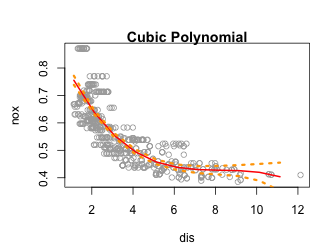
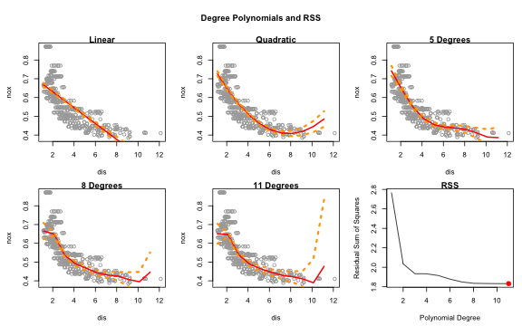
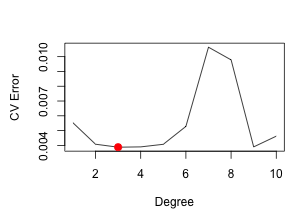
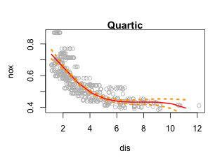
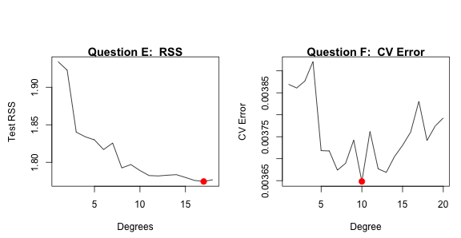

**1.  This question uses the variables `dis` (the weighted mean of distances to five Boston employment centers) and `nox` (nitrogen oxides concentration in parts per 10 million) from the `Boston` data. We will treat `dis` as the predictor and `nox` as the response.**


**(a) Use the `poly()` function to fit a cubic polynomial regression to predict `nox` using `dis`. Report and comment on the regression output, and plot the resulting data and polynomial fits.**


```r
cubic_fit <- lm(nox ~ poly(dis, 3), data = Boston)
coef(summary(cubic_fit))
```

```
##                 Estimate Std. Error    t value      Pr(>|t|)
## (Intercept)    0.5546951 0.00275939 201.020894  0.000000e+00
## poly(dis, 3)1 -2.0030959 0.06207094 -32.271071 1.597201e-124
## poly(dis, 3)2  0.8563300 0.06207094  13.795987  6.133104e-37
## poly(dis, 3)3 -0.3180490 0.06207094  -5.123959  4.274950e-07
```

```r
dislims <- range(dis)
dis_grid <- seq(from = dislims[1], to = dislims[2])
cubic_pred <- predict(cubic_fit, newdata = list(dis = dis_grid), se = TRUE)
se_bands <- cbind(cubic_pred$fit + 2*cubic_pred$se.fit, 
                  cubic_pred$fit - 2*cubic_pred$se.fit)
par(mar = c(4.5,4.5,1,1), oma = c(0,0,2,0))
plot(dis, nox, xlim = dislims, col = "darkgrey", xlab = "dis", ylab = "nox")
title("Cubic Polynomial", outer = FALSE) # title that spans both plots
lines(dis_grid, cubic_pred$fit, lwd = 2, col = "red")
matlines(dis_grid, se_bands, lwd = 3, col = "orange", lty = 3)
```




*The summary of the cubic fit above shows that all of the polynomial coefficients are significant in predicting `nox` from `dis`. The plot shows a smooth curve that fits the data well with confidence intervals that are small until the upper limit of the data.*


**(b) Plot the polynomial fits for a range of different polynomial degrees (say, from 1 to 10); report and comment on the associated residual sum of squares.**



*The RSS decreases as the degree of polynomial increases and thus, the highest polynomial has the lowest RSS.  However, it is clear from the plots that the small and high `dis` values are more and more uncertain (higher confidence intervals on the extremes) with increasing polynomials.*


**(c) Perform cross-validation or another approach to select the optimal degree for the polynomial, and explain your results.**

*Using a 10-fold cross validation*

```r
prediction_error <- rep(0, 10)
for (i in 1:10){ # Run all the polynomial models and store them
  # Use the glm function for poly models instead of lm so we can use cv.glm
   poly_fit <- glm(nox ~ poly(dis, i), data = Boston)
   prediction_error[i] <- cv.glm(Boston, poly_fit, K = 10)$delta[1]}
par(mfrow = c(1,1),  mar = c(4.5,4.5,1,1), oma = c(0,0,2,0)) # plot it!
plot(1:10, prediction_error, xlab = "Degree", ylab = "CV Error", type = "l")
d.min <- which.min(prediction_error)
points(which.min(prediction_error), prediction_error[which.min(prediction_error)], 
       col = "red", cex = 2, pch = 20)
```


*According to a 10-fold cross validation, the CV error reduces from degrees 1-3 and then increases afterwards until 9 degrees, when it decreases and starts to go up again.  The 3rd polynomial is the best model for predicting `nox` from `dis` based on 10-fold CV.*


**(d) Use the `bs()` function to fit a regression spline to predict `nox` using `dis`. Report and comment on the output for the fit using four degrees of freedom. How did you choose the knots? Plot the resulting fit.**

```r
spline_fit <- lm(nox ~ bs(dis, df = 4), data = Wage)
spline_pred <- predict(spline_fit, newdata = list(dis = dis_grid), se = TRUE)
par(mar = c(4.5,4.5,1,1), oma = c(0,0,2,0))
plot(dis, nox, col = "gray");title("Quartic", outer = FALSE)  # Plot the output
lines(dis_grid, spline_pred$fit, lwd = 2, col = "red")
lines(dis_grid, spline_pred$fit + 2* spline_pred$se, lwd = 3, col = "orange", lty = 3)
lines(dis_grid, spline_pred$fit - 2* spline_pred$se,lwd = 3, col = "orange", lty = 3)
```



```r
attr(bs(dis, df = 4), "knots")
```

```
##     50% 
## 3.20745
```

*Above `R` chooses a knot at a `dis` of 3.2 which corresponds to the 50th percentile of `dis`.*


**(e) Now fit a regression spline for a range of degrees of freedom, and plot the resulting fits; report and comment on the resulting RSS. Describe the results obtained.**

*Let's fit polynomial regression splines with degrees of freedom between 3 and 20.*

```r
# Code for *Question E*
RSS_reg_splines <- rep(NA, 18) 
for (i in 3:20) {
    reg_spline_fit <- lm(nox ~ bs(dis, df = i), data = Boston)
    RSS_reg_splines[i] <- sum(reg_spline_fit$residuals^2)}
par(mfrow = c(1,2), mar = c(4.5,4.5,1,1), oma = c(0,0,4,0))
RSS <- RSS_reg_splines[-c(1, 2)]
plot(1:18, RSS, xlab = "Degrees", ylab = "Test RSS", type = "l")
d.min <- which.min(RSS); title("Question E:  RSS", outer = FALSE)
points(which.min(RSS), RSS[which.min(RSS)], col = "red", cex = 2, pch = 20)

# Code for *Question F*
prediction_error <- rep(0, 20); set.seed(232)
for (i in 1:20){ # Run all the polynomial models and store them
  # Use the glm function for poly models instead of lm so we can use cv.glm
   reg_spline_fit <- glm(nox ~ bs(dis, df = i), data = Boston)
   prediction_error[i] <- cv.glm(Boston, reg_spline_fit, K = 10)$delta[1]}
plot(1:20, prediction_error, xlab = "Degree", ylab = "CV Error", type = "l")
d.min <- which.min(prediction_error); title("Question F:  CV Error", outer = FALSE)
points(which.min(prediction_error), prediction_error[which.min(prediction_error)], 
       col = "red", cex = 2, pch = 20)
```




*From the above plot on the left, The RSS decreases monotonically with a minimum RSS at 17 degrees of freedom.*


**(f) Perform cross-validation or another approach in order to select the best degrees of freedom for a regression spline on this data. Describe your results.**

*From the above plot on the right, the CV error is very unstable as the degrees of freedom increases.  However, the minimum CV error is 10 degrees of freedom.*
